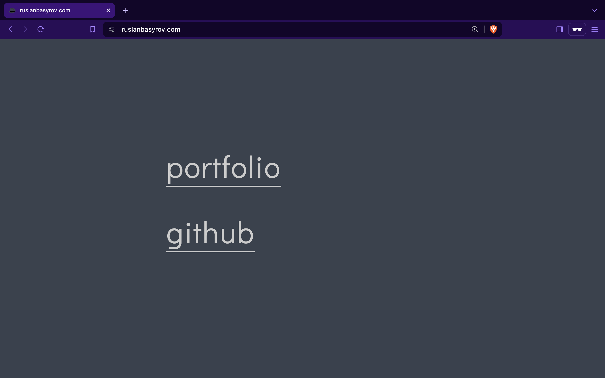

## Portfolio website

[Link to the portfolio website](http://www.ruslanbasyrov.com)

### Description and usage

Simple website set up with Zola. The domain was purchased on Cloudflare, and the website is hosted by AWS S3.

Zola is a static site engine that simplifies development. [The GitHub workflow](https://github.com/johnnymosby/IDS721-portfolio-website/blob/main/.github/workflows/publish.yml) builds and deploys the website to a configured S3 bucket on `git push`. For this, a user was created and used with policies allowing the publication of files.

You can test the project running `zola serve` after installing the necessary dependencies.

### Example

### Some challenges included:
1. "Mixed content" issue. The solution is to add `<meta http-equiv="Content-Security-Policy" content="upgrade-insecure-requests">`.
2. Playing with policies until the minimum required combination was created.
3. I tried to make the website on my own using React until I understood that I lacked the knowledge for this and should concentrate on learning the DevOps skills for this project.

### Sidenotes
The website is simple and lacks content because it served its educational purpose to me. I see this project as a step toward a more comprehensive personal website with interactive elements, a contact form, a containerized build process, test coverage, and more in-demand technologies used. You can see the first attempts in it [here](https://github.com/johnnymosby/cv). I expect it to be finished before the end of the course (before May 2024).
